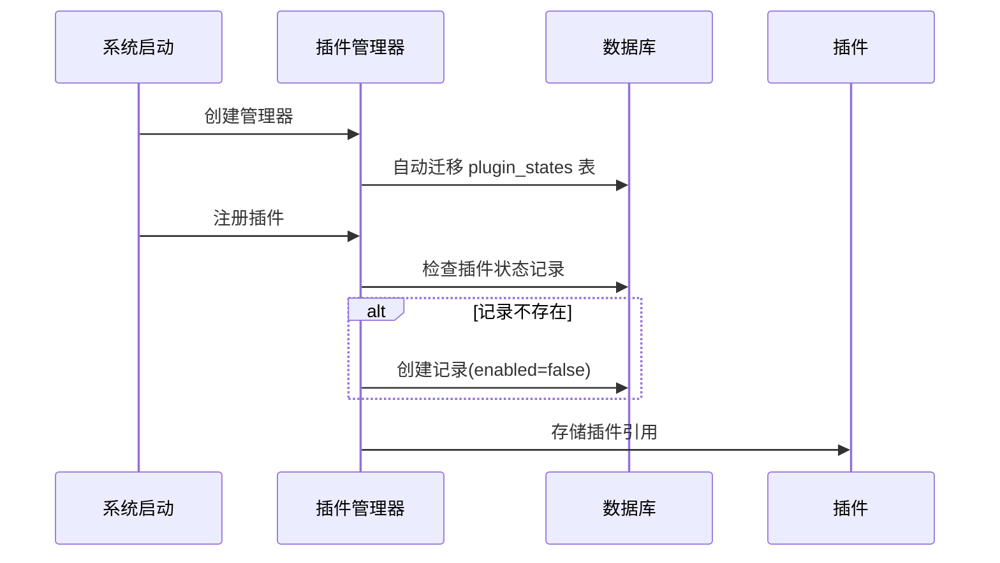
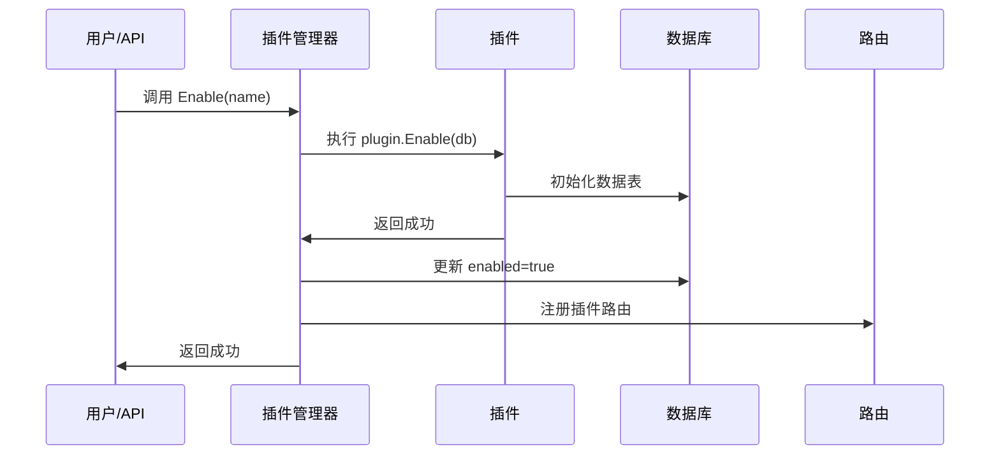
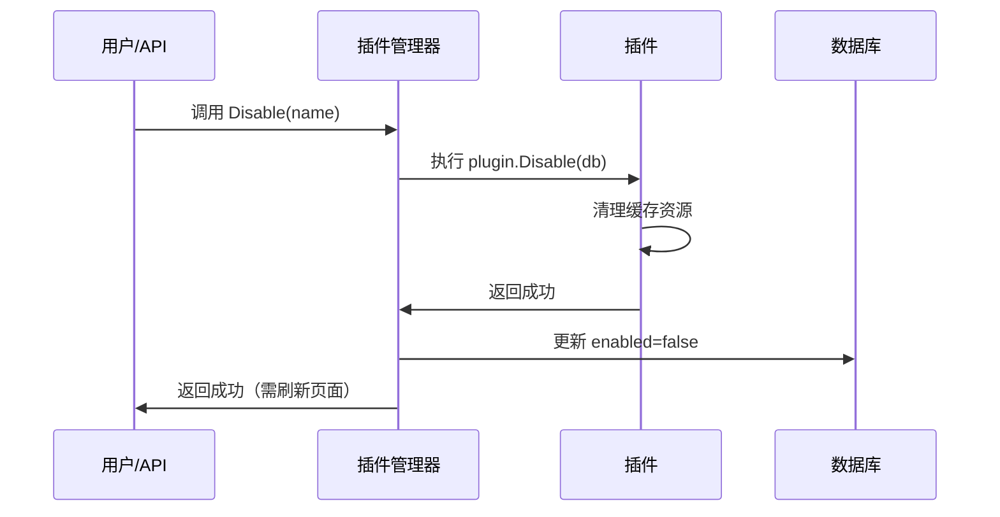

# OpsHub 可插拔插件系统

## 系统概述

OpsHub 实现了完整的前后端可插拔插件架构，Kubernetes 容器管理功能已作为标准插件集成到系统中。

## 核心特性

### 1. 完全可插拔
- ✅ 前后端独立的插件系统
- ✅ 动态加载和卸载插件
- ✅ 插件状态持久化到数据库
- ✅ 无需修改核心代码

### 2. 插件生命周期管理
- ✅ 注册 (Register)
- ✅ 启用 (Enable/Install)
- ✅ 运行 (Running)
- ✅ 禁用 (Disable/Uninstall)

### 3. Kubernetes 插件功能
已实现 10 个完整的功能模块：

1. **集群管理** - /kubernetes/clusters
2. **节点管理** - /kubernetes/nodes
3. **工作负载** - /kubernetes/workloads
4. **命名空间** - /kubernetes/namespaces
5. **网络管理** - /kubernetes/network
6. **配置管理** - /kubernetes/config
7. **存储管理** - /kubernetes/storage
8. **访问控制** - /kubernetes/access
9. **终端审计** - /kubernetes/audit
10. **应用诊断** - /kubernetes/diagnostic

## 快速开始

### 方式一：API 动态控制（推荐）

#### 启用 Kubernetes 插件
```bash
curl -X POST http://localhost:9876/api/v1/plugins/kubernetes/enable \
  -H "Authorization: Bearer YOUR_TOKEN"
```

#### 禁用 Kubernetes 插件
```bash
curl -X POST http://localhost:9876/api/v1/plugins/kubernetes/disable \
  -H "Authorization: Bearer YOUR_TOKEN"
```

#### 查看插件状态
```bash
curl http://localhost:9876/api/v1/plugins \
  -H "Authorization: Bearer YOUR_TOKEN"
```

### 方式二：代码配置

#### 禁用后端插件
编辑 `internal/server/http.go`:
```go
// 注释掉这行即可禁用插件
// if err := pluginMgr.Register(k8splugin.New()); err != nil {
//     appLogger.Error("注册Kubernetes插件失败", zap.Error(err))
// }
```

#### 禁用前端插件
编辑 `web/src/main.ts`:
```typescript
// 注释掉这行即可禁用插件
// import '@/plugins/kubernetes'
```

## 插件管理 API

### 获取所有插件
**GET** `/api/v1/plugins`

响应：
```json
{
  "code": 0,
  "message": "success",
  "data": [
    {
      "name": "kubernetes",
      "description": "Kubernetes容器管理平台",
      "version": "1.0.0",
      "author": "OpsHub Team",
      "enabled": true
    }
  ]
}
```

### 获取插件详情
**GET** `/api/v1/plugins/:name`

### 获取插件菜单
**GET** `/api/v1/plugins/:name/menus`

### 启用插件
**POST** `/api/v1/plugins/:name/enable`

### 禁用插件
**POST** `/api/v1/plugins/:name/disable`

## 技术架构

### 后端架构

```
internal/
├── plugin/
│   └── plugin.go              # 插件管理器和接口定义
│       ├── Plugin Interface   # 插件接口
│       ├── MenuConfig        # 菜单配置
│       ├── PluginState       # 状态持久化模型
│       └── Manager           # 插件管理器
│
└── plugins/
    └── kubernetes/
        └── plugin.go          # Kubernetes 插件实现
            ├── 10个菜单配置
            ├── 完整的路由定义
            └── API处理器
```

**核心组件**:
- **插件管理器 (Manager)**: 负责插件的注册、启用、禁用
- **插件状态 (PluginState)**: 数据库模型，持久化插件启用状态
- **插件接口 (Plugin)**: 所有插件必须实现的接口

### 前端架构

```
web/src/
├── plugins/
│   ├── types.ts              # 类型定义
│   ├── manager.ts            # 插件管理器
│   ├── index.ts              # 导出
│   └── kubernetes/
│       └── index.ts          # Kubernetes 插件
│           ├── 10个菜单配置
│           └── 10个路由配置
│
├── views/
│   └── kubernetes/           # Kubernetes 页面组件
│       ├── Index.vue
│       ├── Clusters.vue
│       ├── Nodes.vue
│       ├── Workloads.vue
│       ├── Namespaces.vue
│       ├── Network.vue
│       ├── Config.vue
│       ├── Storage.vue
│       ├── Access.vue
│       ├── Audit.vue
│       └── Diagnostic.vue
│
└── api/
    └── plugin.ts             # 插件管理 API
```

**核心组件**:
- **插件管理器 (PluginManager)**: 管理插件的安装和卸载
- **路由注册**: 动态注册插件路由到 Vue Router
- **菜单配置**: 与后端菜单配置保持一致

## 数据库设计

### plugin_states 表
```sql
CREATE TABLE plugin_states (
  id BIGINT PRIMARY KEY AUTO_INCREMENT,
  name VARCHAR(100) NOT NULL UNIQUE,
  enabled BOOLEAN NOT NULL DEFAULT FALSE,
  created_at DATETIME,
  updated_at DATETIME
);
```

**说明**:
- `name`: 插件唯一标识
- `enabled`: 是否启用
- 系统启动时自动从此表读取插件状态

## 工作流程

### 插件注册流程



### 插件启用流程



### 插件禁用流程



## 开发新插件

参考文档：
- [插件开发指南](./PLUGIN_DEVELOPMENT.md) - 如何开发新插件
- [插件使用指南](./PLUGIN_USAGE.md) - 如何使用插件系统

### 快速示例

#### 1. 后端插件
```go
package myplugin

import (
    "github.com/gin-gonic/gin"
    "gorm.io/gorm"
    "github.com/ydcloud-dy/opshub/internal/plugin"
)

type MyPlugin struct {
    db *gorm.DB
}

func New() *MyPlugin {
    return &MyPlugin{}
}

func (p *MyPlugin) Name() string { return "myplugin" }
func (p *MyPlugin) Description() string { return "我的插件" }
func (p *MyPlugin) Version() string { return "1.0.0" }
func (p *MyPlugin) Author() string { return "Your Name" }

func (p *MyPlugin) Enable(db *gorm.DB) error {
    p.db = db
    return nil
}

func (p *MyPlugin) Disable(db *gorm.DB) error {
    p.db = nil
    return nil
}

func (p *MyPlugin) RegisterRoutes(router *gin.RouterGroup, db *gorm.DB) {
    router.GET("", p.handler)
}

func (p *MyPlugin) GetMenus() []plugin.MenuConfig {
    return []plugin.MenuConfig{
        {
            Name: "我的插件",
            Path: "/myplugin",
            Icon: "Star",
            Sort: 200,
        },
    }
}

func (p *MyPlugin) handler(c *gin.Context) {
    c.JSON(200, gin.H{"code": 0, "message": "success"})
}
```

#### 2. 前端插件
```typescript
// web/src/plugins/myplugin/index.ts
import { Plugin, PluginMenuConfig, PluginRouteConfig } from '../types'
import { pluginManager } from '../manager'

class MyPlugin implements Plugin {
  name = 'myplugin'
  description = '我的插件'
  version = '1.0.0'
  author = 'Your Name'

  async install() {
    console.log('MyPlugin 安装中...')
  }

  async uninstall() {
    console.log('MyPlugin 卸载中...')
  }

  getMenus(): PluginMenuConfig[] {
    return [{
      name: '我的插件',
      path: '/myplugin',
      icon: 'Star',
      sort: 200,
      hidden: false,
      parentPath: '',
    }]
  }

  getRoutes(): PluginRouteConfig[] {
    return [{
      path: '/myplugin',
      name: 'MyPlugin',
      component: () => import('@/views/myplugin/Index.vue'),
      meta: { title: '我的插件' },
    }]
  }
}

const plugin = new MyPlugin()
pluginManager.register(plugin)
export default plugin
```

## 文件清单

### 核心文件
- ✅ `internal/plugin/plugin.go` - 后端插件管理器
- ✅ `internal/plugins/kubernetes/plugin.go` - Kubernetes 插件实现
- ✅ `internal/server/http.go` - API 路由和处理器
- ✅ `web/src/plugins/types.ts` - 前端类型定义
- ✅ `web/src/plugins/manager.ts` - 前端插件管理器
- ✅ `web/src/plugins/kubernetes/index.ts` - Kubernetes 前端插件
- ✅ `web/src/api/plugin.ts` - 插件管理 API
- ✅ `web/src/main.ts` - 前端入口（插件自动安装）

### 文档文件
- ✅ `docs/PLUGIN_DEVELOPMENT.md` - 插件开发指南
- ✅ `docs/PLUGIN_USAGE.md` - 插件使用指南
- ✅ `docs/PLUGIN_README.md` - 本文档

### 页面组件 (10个)
- ✅ `web/src/views/kubernetes/Index.vue`
- ✅ `web/src/views/kubernetes/Clusters.vue`
- ✅ `web/src/views/kubernetes/Nodes.vue`
- ✅ `web/src/views/kubernetes/Workloads.vue`
- ✅ `web/src/views/kubernetes/Namespaces.vue`
- ✅ `web/src/views/kubernetes/Network.vue`
- ✅ `web/src/views/kubernetes/Config.vue`
- ✅ `web/src/views/kubernetes/Storage.vue`
- ✅ `web/src/views/kubernetes/Access.vue`
- ✅ `web/src/views/kubernetes/Audit.vue`
- ✅ `web/src/views/kubernetes/Diagnostic.vue`

## 使用示例

### 示例 1: 通过 API 管理插件

```typescript
// 前端代码示例
import { enablePlugin, disablePlugin, listPlugins } from '@/api/plugin'

// 获取所有插件
const { data } = await listPlugins()
console.log(data.data) // 插件列表

// 启用 Kubernetes 插件
await enablePlugin('kubernetes')

// 禁用 Kubernetes 插件
await disablePlugin('kubernetes')
```

### 示例 2: 通过代码配置

```go
// internal/server/http.go
func NewHTTPServer(conf *conf.Config, svc *service.Service, db *gorm.DB) *HTTPServer {
    // ... 省略其他代码 ...

    // 注册插件
    pluginMgr := plugin.NewManager(db)

    // 注册 Kubernetes 插件
    if err := pluginMgr.Register(k8splugin.New()); err != nil {
        appLogger.Error("注册Kubernetes插件失败", zap.Error(err))
    }

    // 注册其他插件...
    // if err := pluginMgr.Register(otherplugin.New()); err != nil {
    //     appLogger.Error("注册OtherPlugin插件失败", zap.Error(err))
    // }

    // 启用所有插件
    s.enablePlugins()

    // ... 省略其他代码 ...
}
```

## 注意事项

1. **刷新页面**: 启用/禁用插件后需要刷新页面才能完全生效
2. **数据安全**: 禁用插件不会删除数据库表，数据会保留
3. **路由限制**: Vue Router 不支持动态删除路由，禁用插件后需刷新页面
4. **并发安全**: 插件管理器是线程安全的，可以并发操作
5. **依赖管理**: 插件之间应保持独立，避免相互依赖

## 后续规划

- [ ] 支持插件版本升级
- [ ] 支持插件热重载（无需刷新页面）
- [ ] 插件市场和在线安装
- [ ] 插件依赖管理
- [ ] 插件权限细粒度控制
- [ ] 插件性能监控和统计

## 技术支持

- 📧 Email: support@opshub.com
- 🐛 Issues: https://github.com/ydcloud-dy/opshub/issues
- 📖 Wiki: https://github.com/ydcloud-dy/opshub/wiki
